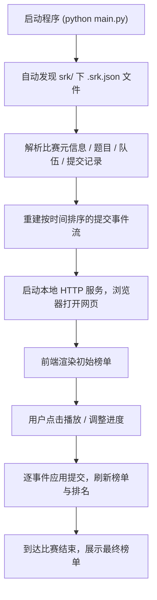

# XCPC 实时榜单回放程序 — 产品需求文档（PRD）

## 1. 产品概述
一个基于 Python 的 XCPC（ICPC 系程序设计竞赛）实时榜单回放工具。程序自动读取指定目录下 `srk/` 子文件夹中的 `.srk.json` 比赛数据文件，解析出完整的提交时间线，并在网页端以实时榜单的形式还原比赛全程的动态变化，支持播放 / 暂停 / 快进 / 后退等时间轴控制。

- 目标用户：竞赛组织者、选手复盘、出题人 / 教练、榜单分析爱好者。
- 价值：无需搭建复杂环境，纯 Python 标准库即可在任何平台（Windows / macOS / Linux）离线运行，让用户自由、直观地回放任意一场 XCPC 比赛。

## 2. 核心功能

### 2.1 功能模块
1. **数据解析模块**：自动发现并解析 `srk/` 子文件夹中的 `.srk.json` 文件，提取比赛元信息、题目列表、队伍信息与全部提交记录。
2. **回放引擎模块**：将解析结果重建为按时间排序的提交事件流，并实现 ICPC 计分与排名算法。
3. **网页榜单界面**：还原 XCPC 常规榜单（队名、学校、每题状态、过题数、罚时、排名），随回放进度实时更新。
4. **时间轴控制**：播放 / 暂停、倍速切换、进度拖动、上一 / 下一事件、跳转比赛开始 / 结束。
5. **比赛信息展示**：当前比赛时间、真实时钟时间、题目统计数据、最近提交动态。
6. **自动化测试**：用真实 `.srk.json` 与程序生成的多种规模合成数据校验解析与回放的正确性。

### 2.2 页面详情
| 页面名称 | 模块名称 | 功能描述 |
|-----------|-------------|---------------------|
| 回放主页 | 顶部信息栏 | 比赛名称、当前比赛时刻（含进度）、比赛开始/结束时间、文件选择器 |
| 回放主页 | 榜单表格 | 实时排名、队伍名、学校、逐题状态（AC/封榜/失败/未提交）、过题数与罚时、奖牌标识 |
| 回放主页 | 事件面板 | 最近提交动态流（提交方、题目、结果、时刻） |
| 回放主页 | 时间轴控制条 | 播放/暂停、倍速（0.5×~∞）、进度滑块、上一/下一事件、跳转首尾 |

## 3. 核心流程

用户启动程序 → 打开浏览器 → 选择 `srk/` 文件夹中的某个 `.srk.json` 文件 → 程序解析并重建提交时间线 → 界面渲染初始榜单 → 用户点击播放 → 榜单随提交事件实时变化（过题、罚时、排名刷新） → 用户可随时暂停、拖动进度或切换倍速 → 到达比赛结束显示最终榜单。

## 4. 用户界面设计

### 4.1 设计风格
- **视觉基调**：深色"赛博看板"风格 —— 深蓝黑底 + 荧光绿 / 金色点缀，契合竞技编程看板氛围；信息密度高但层次分明。
- **主色**：背景 `#0b0f1a`，文字 `#e8ecf4`，强调色 `#3df05a`（AC 绿），`#ff5c5c`（失败红），`#ffd700`（首杀金），`#f7b955`（封榜黄）。
- **字体**：数字与榜单使用等宽字体（`JetBrains Mono` / `Consolas` 回退），中文使用系统黑体栈，保证榜单数字对齐与可读性。
- **布局**：顶部信息条 + 主榜单表格 + 右侧/底部事件流 + 底部时间轴控制条；桌面优先，窄屏下事件流折叠。
- **动效**：过题时单元格闪烁亮起、排名变化时行背景高亮过渡、事件流新条目滑入。

### 4.2 页面设计概览
| 页面名称 | 模块名称 | UI 元素 |
|-----------|-------------|-------------|
| 回放主页 | 顶部信息栏 | 比赛标题、当前比赛时刻大字号、进度条、真实时间、文件下拉选择 |
| 回放主页 | 榜单表格 | 固定表头、排序列、队伍行、题目单元格颜色状态、罚时/过题数、奖牌图标 |
| 回放主页 | 事件面板 | 滚动事件列表，每行"队伍 × 题目 × 结果 × 时刻" |
| 回放主页 | 时间轴控制条 | 播放/暂停按钮、倍速选择、进度滑块、跳转按钮 |

### 4.3 响应式
- 桌面优先设计；最小宽度 1024px 下完整呈现榜单与事件面板。
- 窄屏（< 1024px）时事件面板折叠为可展开抽屉，榜单表格横向滚动。
