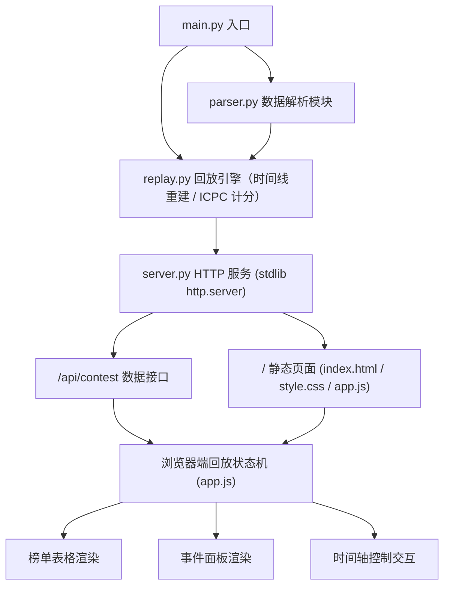
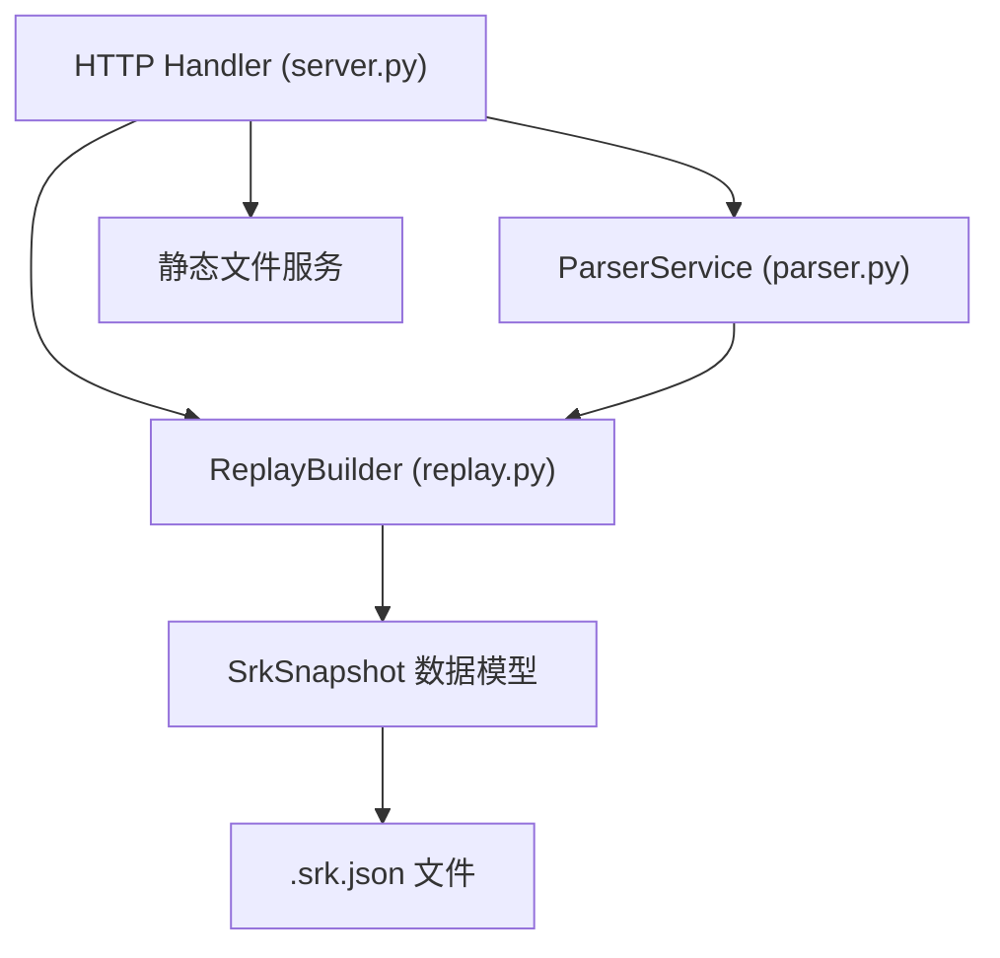
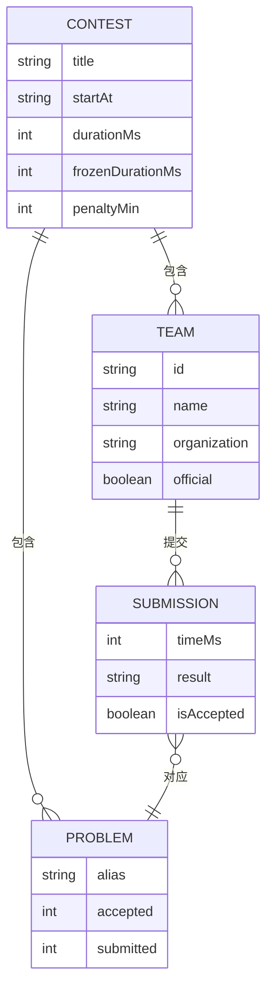

# XCPC 实时榜单回放程序 — 技术架构文档

## 1. 架构设计

整体采用「Python 解析与数据服务 + 浏览器端渲染」的两层架构：Python 负责文件发现、数据解析、时间线重建与静态资源 / API 服务；前端负责榜单渲染、回放状态机与交互。前端拿到的是**一次性的完整数据载荷**，回放计算全部在浏览器端增量完成，后端无状态、可水平替换。



## 2. 技术选型

- **后端**：Python 3.8+ 标准库（`http.server` / `json` / `argparse` / `urllib`），零第三方依赖，保证 Windows / macOS / Linux 跨平台开箱即用。
- **前端**：原生 HTML5 + CSS3 + Vanilla JS（无构建步骤、无 CDN 依赖），可完全离线运行。
- **数据文件**：`.srk.json`（XCPCIO SRK 榜单快照格式，含 `contest / problems / rows / sorter / series`，其中 `rows[].statuses[].solutions[]` 提供完整提交记录）。
- **初始化工具**：无（标准库与手写文件即完成工程初始化）。

> 说明：架构模板默认倾向 React，但本产品对「任意平台零依赖可运行」有硬性要求（需求 #8），引入 Node/构建链反而削弱健壮性；单页面应用规模小、状态机简单，原生实现更利于维护与扩展。

## 3. 服务端路由定义

| 路由 | 用途 |
|-------|---------|
| `/` | 返回回放主页 `index.html` |
| `/static/*` | 静态资源（`style.css`、`app.js`） |
| `/api/files` | 列出 `srk/` 子文件夹中可用的 `.srk.json` 文件列表 |
| `/api/contest?file=<名称>` | 返回指定比赛的完整回放数据载荷 |

## 4. 数据接口定义

### 4.1 `GET /api/files`
```json
{ "files": ["shcpc2026.srk.json"], "default": "shcpc2026.srk.json" }
```

### 4.2 `GET /api/contest?file=xxx`
统一载荷，前端据此完成全部回放：
```jsonc
{
  "title": "比赛名称",
  "startAt": "2026-07-26T10:00:00+08:00",
  "durationMs": 14400000,          // 比赛总时长(ms)
  "problems": [
    { "alias": "A", "accepted": 63, "submitted": 595 }
  ],
  "series": [{ "title": "#", "counts": [14, 28, 42] }],  // 金/银/铜数量
  "penaltyMin": 20,                // 罚时分钟数
  "teams": [
    { "id": "C417-08", "name": "夏日影", "organization": "上海交通大学", "official": true }
  ],
  "events": [                      // 全量提交事件，按时间升序
    { "t": 2515945, "team": 0, "problem": 0, "result": "WA", "ac": false }
  ]
}
```

## 5. 服务端分层架构



- `parser.py`：负责 `.srk.json` 反序列化与字段容错（缺失字段给默认值），产出结构化模型。
- `replay.py`：从各队伍 `statuses[].solutions[]` 汇总全部提交 → 按毫秒时间升序排序 → 生成事件流；实现 ICPC 计分（AC 时间 + 罚时 20min/次错误）与排名（过题数降序、罚时升序、并列同名次）；提供 `validate_against_snapshot()` 用文件内最终榜单校验回放结果。
- `server.py`：`ThreadingHTTPServer`，路由分发，正确设置 `Content-Type` / 缓存头与 UTF-8 编码。

## 6. 数据模型

### 6.1 数据模型定义



### 6.2 回放状态机（前端）
```
IDLE(初始) → PLAYING(逐事件推进) → PAUSED(暂停) → PLAYING(恢复)
任意状态 → SEEK(拖动进度/跳转) → 重建到目标时刻的榜单快照
```

### 6.3 计分与排名规则（对齐文件内 `sorter` 配置）
- 过题数 = 已 AC 题目数；罚时 = Σ(AC 时刻分钟数 + 20 × 该题 AC 前的错误提交数)。
- 错误提交（WA/RTE/TLE/CE 等）只在该题最终 AC 时计入罚时；未过题的错误提交不计罚时。
- 排名：过题数降序 → 罚时升序；同分并列同名次，后续名次顺延（standard ICPC）。
- 奖牌：按 `series` 中金/银/铜数量划分名次区间（金 1..14、银 15..28、铜 29..42）。
